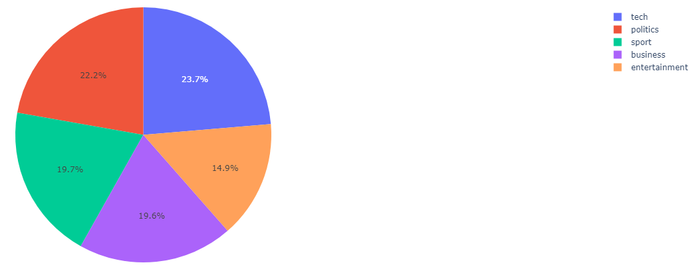
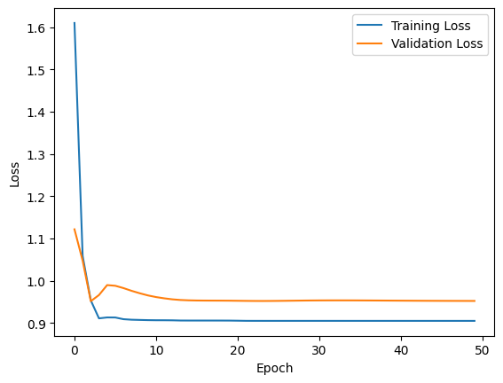
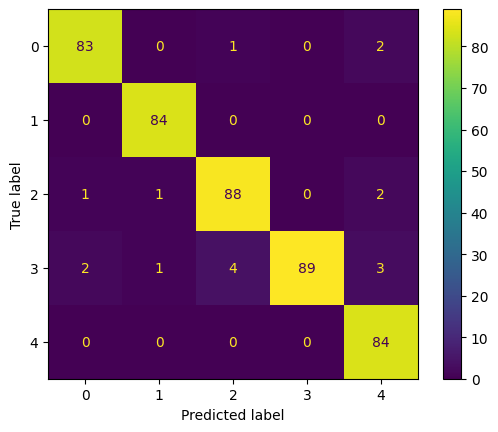

# Machine Learning and Text Classification BBC Texts

In this Google Colab, I set up a shallow neural net and train it on a supervised data set of BBC News Texts with category tags. For the full description of this project, see my post 
[Supervised Machine Learning & BBC Text Classification](https://ycvogt.github.io/my_portfolio/posts/ml_classificationtext.html) on my portfolio website.

* __Libraries__: Pandas, Numpy, PyTorch, Sklearn, Plotly
* __Data__: www.kaggle.com/datasets/hgultekin/bbcnewsarchive

The data set has the following distribution:




The neural net is set up like this: 
```
class ClassificationNet(nn.Module):

    def __init__(self):
        super(ClassificationNet, self).__init__()
        self.layers = nn.Sequential(
        nn.Linear(23699, 512), #feature number, first layer size
        nn.Hardtanh(),
        nn.Linear(512,5) #we have 5 categories!
        )

    def forward(self, x): #forward pass, input shape(data points, feature number)
        sm = nn.Softmax(dim=1) #activation function
        x = sm(self.layers(x))
        return x

net = ClassificationNet()
```
```
# learning rate
lrt=0.01
# optimizer
optimizer = optim.Adam(net.parameters(), lr=lrt)
# loss/criterion
criterion = nn.CrossEntropyLoss()
# epochs / number of training iterations
epochs = 50
```
After training, we get the following graph for our training and validation loss:



Our evaluation on the test set produces the following confusion matrix:


